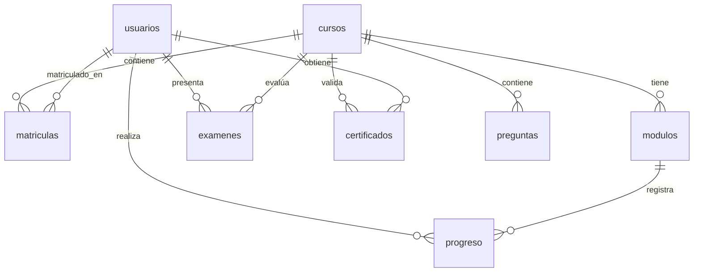

# Arquitectura y Diseño del Sistema - Instituto Superior del Norte LMS

Este documento define la arquitectura vigente, los patrones adoptados, la estructura de directorios actual y las decisiones de diseño que los agentes deben respetar.

---

## 1. Patrón Arquitectónico

### Backend (Layered Architecture — Implementada)

El backend sigue una arquitectura en capas completamente implementada:

```
INFRASTRUCTURE (Express, SQLite, Middlewares)
  └── CONTROLLERS (Parseo HTTP, Formato de Respuesta)
        └── SERVICES (Lógica de Negocio Pura)
              └── REPOSITORIES (Consultas SQL Aisladas)
```

| Capa | Archivo | Responsabilidad |
|---|---|---|
| Infrastructure | `server.js`, `middleware/auth.js`, `middleware/errorHandler.js` | Express, CORS, JWT, manejo global de errores, `ADMIN_ROLES` (fuente única de roles privilegiados) |
| Routes | `routes/authRoutes.js`, `routes/adminRoutes.js`, `routes/studentRoutes.js`, `routes/publicRoutes.js` | Registro de endpoints y aplicación de middlewares |
| Controllers | `controllers/authController.js`, `controllers/adminController.js`, `controllers/studentController.js`, `controllers/publicController.js` | Parseo de request, validación de payload, formato de response |
| Services | `services/pdfService.js`, `services/emailService.js` | Generación de PDFs, envío de emails |
| Repositories | `repositories/dbRepository.js` | Consultas SQL aisladas, inicialización de BD, seeding |

### Frontend (Context + Router Architecture)

```
AppProvider (AppContext.jsx)       ← Estado global y fetch functions
  └── HashRouter (App.jsx)
        └── MainLayout             ← Navbar, Footer, Routes, Auth Guard
              └── Routes
                    ├── /login             → Login.jsx
                    ├── /admin/login       → AdminLogin.jsx
                    ├── /dashboard         → Dashboard.jsx (Mis Cursos Inscritos)
                    ├── /course/:courseId/detail → CourseRouteWrapper → CourseDetail.jsx
                    ├── /course/:courseId  → CourseRouteWrapper → CourseViewer.jsx
                    ├── /course/:id/exam   → CourseRouteWrapper → Exam.jsx
                    ├── /certificate/:id   → CourseRouteWrapper → Certificate.jsx
                    ├── /admin/dashboard   → AdminDashboard.jsx
                    ├── /admin/create-course → CreateCourseScreen.jsx
                    └── /verify/:code      → VerifyCertificate.jsx
```

**Regla de Navegación (CRÍTICA):** React Router es la **única fuente de verdad** de la navegación. Todos los componentes usan `useNavigate()` de `react-router-dom` para cambiar de vista. **Nunca usar `setCurrentView()` para navegar** — `currentView` es un estado legacy mantenido por compatibilidad pero no controla las rutas.

---

## 2. Estructura de Directorios Actual

```
/Alimentos (raíz del proyecto)
├── .gemini/
│   ├── contexto_sistema.md      # Negocio, estado actual, brechas
│   ├── arquitectura_y_diseño.md # Este archivo
│   └── buenas_practicas.md      # Reglas de código y seguridad
├── api_contract.md              # Contratos de API frontend ↔ backend
├── api_docs.md                  # Especificación técnica de endpoints
├── backend/
│   ├── .env                     # Variables de entorno (PORT, JWT_SECRET, SMTP_*, FRONTEND_URL)
│   ├── package.json
│   └── src/
│       ├── server.js            # Express: configuración, CORS, registro de routers
│       ├── database.sqlite      # Base de datos SQLite activa
│       ├── assets/
│       │   └── logo instituto superior del norte.png # Logo oficial para toda la aplicación (Frontend/Backend)
│       ├── middleware/
│       │   ├── auth.js          # authenticateToken, requireAdmin, normalizeToUtf8
│       │   └── errorHandler.js  # Centralized error handler — no expone stack traces
│       ├── routes/
│       │   ├── authRoutes.js    # POST /api/auth/login, /register
│       │   ├── adminRoutes.js   # GET/POST /api/admin/* (requiere admin)
│       │   ├── studentRoutes.js # GET/POST /api/student/*, /course/*, /exam/*, /certificate/*
│       │   └── publicRoutes.js  # GET /api/certificate/verify/:codigo (sin auth)
│       ├── controllers/
│       │   ├── authController.js    # login, register
│       │   ├── adminController.js   # getCourses, createCourse (con precio), getMetrics, getUsers, createStudent (+ metadatos + bypass de certificación), updateStudentCourses, downloadStudentCertificate
│       │   ├── studentController.js # getStudentCourses, getCourseContent, getProgress, updateProgress, getExamQuestions, submitExam (+ email certificado), getCertificateDetail, downloadCertificate
│       │   └── publicController.js  # verifyCertificate
│       ├── services/
│       │   ├── pdfService.js    # generateCertificatePDF (stream a HTTP response)
│       │   └── emailService.js  # sendWelcomeEmail, sendCertificateEmail (Nodemailer + Ethereal fallback)
│       └── repositories/
│           └── dbRepository.js  # Inicialización BD idempotente, seeding, todas las consultas SQL
└── frontend/
    ├── package.json
    ├── vite.config.js
    └── src/
        ├── main.jsx
        ├── index.css            # Tokens CSS globales (variables :root)
        ├── App.jsx              # HashRouter, MainLayout, Routes, Auth Guard
        ├── assets/              # Logos e imágenes estáticas
        ├── components/
        │   ├── Login.jsx
        │   ├── AdminLogin.jsx
        │   ├── Dashboard.jsx
        │   ├── CourseDetail.jsx
        │   ├── CourseViewer.jsx
        │   ├── Exam.jsx
        │   ├── Certificate.jsx
        │   ├── AdminDashboard.jsx
        │   ├── CreateCourseScreen.jsx
        │   └── VerifyCertificate.jsx
        └── context/
            └── AppContext.jsx   # Estado global, fetch functions, autenticación
```

---

## 3. AppContext — Diseño y Reglas de Uso

`AppContext.jsx` centraliza todo el estado de la aplicación. Reglas para modificarlo:

### Estado Inicializado
- `token`, `user`, `currentView` se inicializan sincrónicamente con **lazy `useState`** leyendo el JWT del `localStorage`.
- **NUNCA** agregar un `useEffect([token])` que llame `setUser()`. Esto causa bucles de renderizado porque crea un nuevo objeto `user` en cada ejecución, disparando `useEffect([..., user])` indefinidamente.

### Dependencias de useEffect
- **SIEMPRE** usar dependencias primitivas para objetos de estado: `user?.cedula`, `user?.rol` en lugar de `user`.
- Objetos en deps de `useEffect` se comparan por referencia → cada render crea un objeto "nuevo" aunque tenga los mismos valores → loop infinito garantizado.

### Fetch Functions
- Todas las funciones de fetch están envueltas en `useCallback` con `[token]` como dependencia.
- Esto estabiliza la referencia de la función entre renders y permite incluirlas en deps de `useEffect` sin causar loops.


---

## 4. Base de Datos — Esquema ER



### Tablas del Sistema
| Tabla | Descripción |
|---|---|
| `usuarios` | `cedula`, `nombre_completo`, `password_hash`, `rol`, `fecha_registro`, `fecha_expedicion_cedula`, `municipio_expedicion_cedula`, `municipio_nacimiento`, `anio_nacimiento`, `pago_realizado` |
| `cursos` | `titulo` (UNIQUE), `descripcion`, `imagen_url`, `creado_en`, `precio`, `certificado_template` (HTML opcional) |
| `matriculas` | Relación N:M entre `usuarios` y `cursos` |
| `modulos` | `curso_id`, `titulo_modulo`, `tipo_contenido`, `data_contenido` (JSON `{url, text}`), `orden` |
| `progreso` | `usuario_cedula`, `modulo_id`, `completado`, `fecha_completado` |
| `examenes` | `usuario_cedula`, `curso_id`, `puntaje_maximo`, `aprobado`, `intentos`, `fecha_ultimo_intento` |
| `certificados` | `codigo_verificacion`, `usuario_cedula`, `curso_id`, `numero_certificado`, `fecha_emision`, `calificacion_obtenida` |
| `preguntas` | `curso_id`, `pregunta`, `opcion_a`, `opcion_b`, `opcion_c`, `opcion_d`, `respuesta_correcta` |

### Restricción UNIQUE(titulo) y Limpieza de Duplicados
Para evitar que la sentencia `INSERT OR IGNORE` del seeding genere registros duplicados en arranques o reinicios del servidor, la columna `titulo` de la tabla `cursos` posee la restricción `UNIQUE` y un índice único `idx_cursos_titulo`. 

Al iniciar, se ejecuta de manera automática una migración atómica (`cleanDuplicateCoursesSQLite`) que:
1. Identifica cursos duplicados con el mismo título.
2. Re-mapea las claves foráneas en cascada en las tablas dependientes (`modulos`, `matriculas`, `progreso`, `examenes`, `certificados`, `preguntas`) para que apunten al `id` del curso único conservado (el más antiguo, `MIN(id)`).
3. Elimina de forma segura los cursos duplicados y sus módulos duplicados correspondientes.

### Regla de Seeding
- El seeding usa `INSERT OR IGNORE` en todas las tablas para ser **idempotente** — seguro de ejecutar en cada arranque sin borrar datos existentes.
- **NUNCA** usar `DROP TABLE` + `CREATE TABLE` en `setupSqliteDB()`. Esto destruiría datos de producción en cada reinicio.

### Esquema de la tabla `preguntas`
```sql
CREATE TABLE IF NOT EXISTS preguntas (
    id INTEGER PRIMARY KEY AUTOINCREMENT,
    curso_id INTEGER NOT NULL,
    pregunta TEXT NOT NULL,
    opcion_a TEXT NOT NULL,
    opcion_b TEXT NOT NULL,
    opcion_c TEXT NOT NULL,
    opcion_d TEXT NOT NULL,
    respuesta_correcta TEXT NOT NULL, -- 'A', 'B', 'C' o 'D'
    FOREIGN KEY (curso_id) REFERENCES cursos(id) ON DELETE CASCADE
);
```

### Sistema de Plantillas de Certificado por Curso (Multi-Course Layouts)
La columna `cursos.certificado_template` almacena una plantilla HTML cruda opcional que define el diseño visual del diploma de ese curso. Cuando está presente:

1. **`studentController.getCertificateDetail()`** obtiene la plantilla vía JOIN (`certificados` → `cursos`) y la interpola con la función `interpolateTemplate()` antes de enviarla al cliente.
2. **Tags de interpolación soportados:** `{{NOMBRE}}`, `{{CEDULA}}`, `{{FECHA_EXPEDICION}}`, `{{MUNICIPIO_EXPEDICION}}`, `{{ANIO_NACIMIENTO}}`, `{{CODIGO_VERIFICACION}}`, `{{FECHA_EMISION}}`.
3. **Frontend (`Certificate.jsx`):** Si `certData.certificado_template` existe, lo renderiza vía `dangerouslySetInnerHTML` (con estilos `@media print` para impresión/PDF nativa del navegador). Si no existe, renderiza la plantilla institucional por defecto en React.
4. **PDF (`pdfService.js`):** Actualmente siempre genera la plantilla institucional por defecto con `pdfkit` (bordes dorados, logo, firma). **Brecha:** el PDF no consume la plantilla HTML personalizada del curso.

Cuando `certificado_template` es `NULL`, se usa la plantilla institucional por defecto en todos los flujos.

### Regla de Seeding
- El seeding usa `INSERT OR IGNORE` en todas las tablas para ser **idempotente** — seguro de ejecutar en cada arranque sin borrar datos existentes.
- **NUNCA** usar `DROP TABLE` + `CREATE TABLE` en `setupSqliteDB()`. Esto destruiría datos de producción en cada reinicio.

---

## 5. Sistema de Notificaciones por Email

`emailService.js` expone dos funciones con el patrón **fire-and-forget**:

```js
// Disparado desde adminController.createStudent()
sendWelcomeEmail({ cedula, nombre_completo, password, cursos })

// Disparado desde studentController.submitExam() cuando approved === true
sendCertificateEmail(studentData, certData, courseTitle)
```

**Modo desarrollo (SMTP_USER vacío en .env):**
- Genera automáticamente una cuenta efímera en Ethereal Email.
- El URL de previsualización del email se imprime en consola del backend.
- No se envían emails reales.

**Modo producción (SMTP_USER + SMTP_PASS configurados en .env):**
- Usa el transporte SMTP configurado (Gmail, SendGrid, Mailtrap).
- Configura `FRONTEND_URL` para que el link del certificado apunte al dominio real.
- **Destinatario derivado:** el email del estudiante se deduce como `${cedula}@institutosuperiordelnorte-student.co` (campo `email` aún no existe en `usuarios`).

---

## 6. Roles y Rutas Protegidas

| Rol | Rutas Permitidas |
|---|---|
| Sin auth | `/login`, `/admin/login`, `/verify`, `/verify/:code` |
| `estudiante` | `/dashboard`, `/course/:id`, `/course/:id/exam`, `/certificate/:id` |
| `administrador` | `/admin/dashboard`, `/admin/create-course` (además, acceso completo a `/api/admin/*` excepto `financial-metrics`) |
| `ingeniero_software` | `/admin/dashboard`, `/admin/create-course` (además, acceso exclusivo a `/api/admin/financial-metrics`) |

> **Source of truth para roles privilegiados:** la constante `ADMIN_ROLES` en `backend/src/middleware/auth.js` y su espejo `ADMIN_ROLES`/`isAdmin` en `frontend/src/context/AppContext.tsx`. Cualquier adición o remoción de roles privilegiados debe hacerse en ambos puntos simultáneamente.

**Auth Guard (doble capa):**
- **A nivel de ruta (frontend):** `<ProtectedRoute allowRoles={[...]}>` (en `App.jsx`) envuelve cada ruta privada y redirige a un usuario autenticado con rol equivocado a su home correspondiente. Es la fuente de verdad para la autorización de vistas.
- **A nivel de efecto (legacy):** El `useEffect` en `App.jsx` con dependencias primitivas (`user?.cedula`, `user?.rol`) sólo se encarga de redirigir desde `/login`, `/admin/login` o `/` al dashboard que corresponda tras autenticar. No reemplaza a `<ProtectedRoute>`.
- Si no hay token → redirige a `/login` (excepto rutas públicas).

**`CourseRouteWrapper`:** Sincroniza `activeCourseId` desde el parámetro `:courseId` de la URL (único punto de URL→estado para course IDs). Permite deep linking directo a `/course/1`.

---

## 7. Brechas Arquitectónicas Pendientes

> [!TIP]
> **Mejoras Recomendadas (por prioridad):**
> 1. **Agregar campo `email` a `usuarios`** → Actualmente el email del estudiante se deduce como `${cedula}@alimsafe-student.co`. Para producción real, agregar columna `email` al formulario de creación.
> 2. **Resolver Mojibake en origen** → configurar `pragma encoding = 'UTF-8'` en SQLite y eliminar funciones `decodeMojibake` y `normalizeToUtf8` progresivamente.
> 3. **Componentes Monolíticos** → `AdminDashboard.jsx` (~35KB) maneja múltiples CRUDs. Candidato a dividir en sub-componentes.
> 4. **Validación de Payloads** → Integrar `zod` en el backend para sanear inputs antes de operar en BD.
